# User Flow Diagrams - BUILDWHILEBLEEDING Studio

This document outlines the main user flows and interactions within the BUILDWHILEBLEEDING Studio application.

## Overview

The application is designed for audio engineers to separate and mix drum stems from master audio files, with the assistance of an AI processor. The main workflows revolve around audio file management, stem separation, mixing, and AI interaction.

## Main User Flows

### 1. Audio File Upload Flow

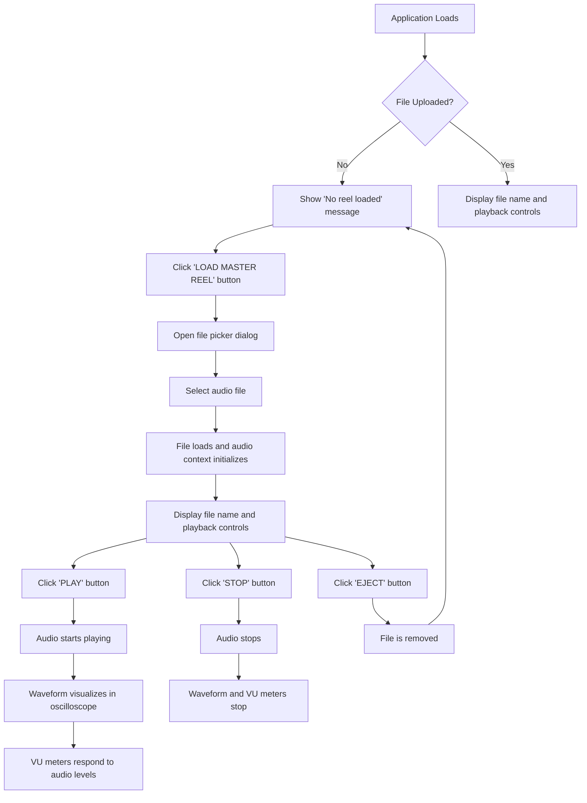

### 2. Audio Processing Flow

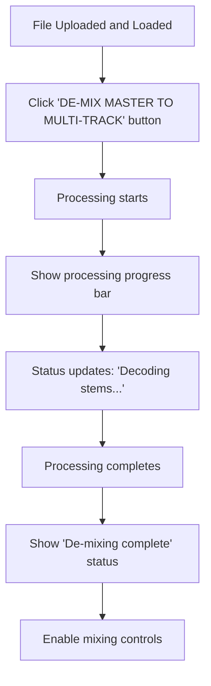

### 3. Mixing Console Flow

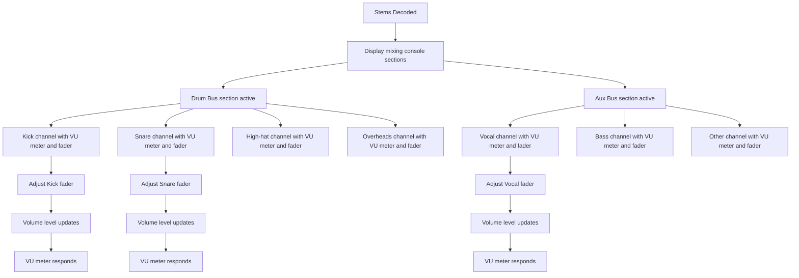

### 4. AI Assistant Text Command Flow

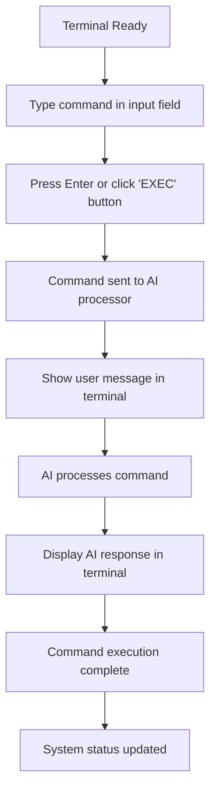

### 5. AI Assistant Voice Command Flow

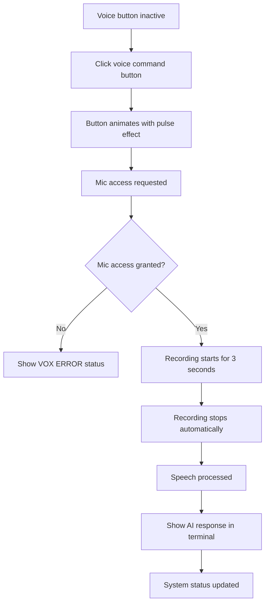

### 6. System Status Flow

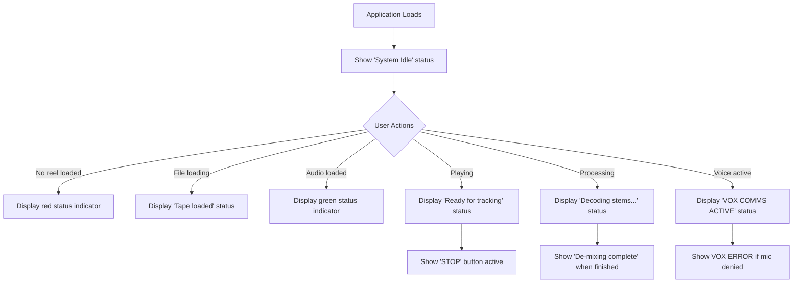

### 7. Audio Visualization Flow

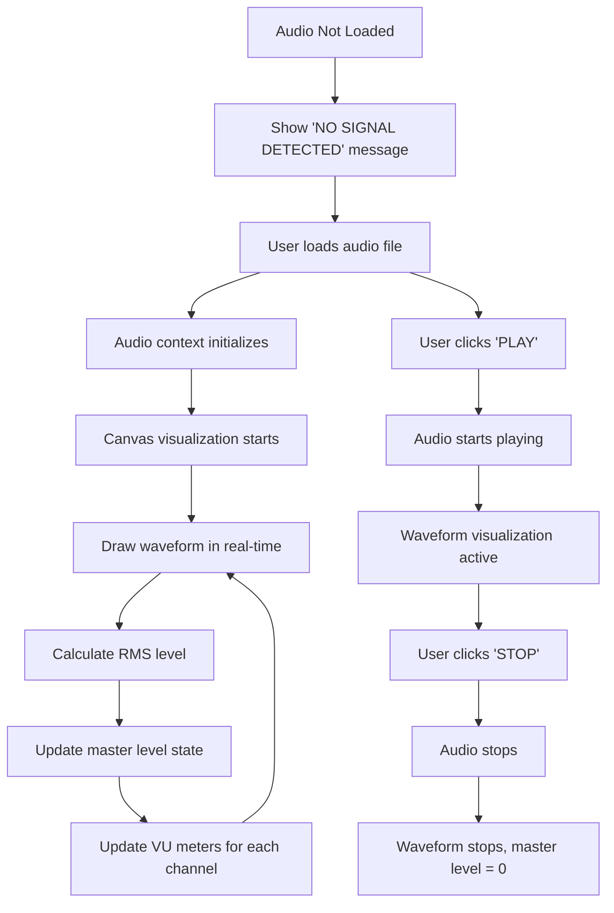

## Detailed Workflow Descriptions

### Audio File Management

**Purpose**: Allow users to load and manage audio files for processing

**Steps**:
1. User clicks "LOAD MASTER REEL" button
2. File picker dialog opens
3. User selects audio file (MP3, WAV, etc.)
4. File is loaded into audio context
5. Playback controls become available
6. User can play, pause, or eject the file

**Key States**:
- No reel loaded
- Loading
- Loaded and ready
- Playing
- Stopped

### Stem Separation

**Purpose**: Process audio file to extract individual stems

**Steps**:
1. User loads and audio file
2. User clicks "DE-MIX MASTER TO MULTI-TRACK" button
3. Processing progress indicator appears
4. System decodes and separates stems
5. Mixing console becomes active
6. Stems are ready for mixing

**Key States**:
- Inactive (no file loaded)
- Loading stems
- Stems available
- Processing in progress

### Mixing Control

**Purpose**: Adjust levels of individual stems

**Steps**:
1. Stems are available after separation
2. User interacts with vertical faders
3. Fader value updates volume for that stem
4. VU meter reflects new level
5. Volume changes apply real-time to audio

**Key States**:
- Controls disabled (file not processed)
- Controls enabled (stems available)
- Active adjustment

### AI Assistant Interaction

**Purpose**: Provide intelligent assistance for audio engineering tasks

**Text Command Steps**:
1. User types command in input field
2. User presses Enter or clicks "EXEC"
3. Command is sent to AI processor
4. AI generates response
5. Terminal displays conversation history

**Voice Command Steps**:
1. User clicks voice command button
2. System requests microphone access
3. User speaks command (3 second limit)
4. Voice is processed
5. AI generates response
6. Terminal displays conversation history

### System Monitoring

**Purpose**: Provide real-time system status information

**Status Messages**:
- System Idle
- No reel loaded
- Tape loaded
- Ready for tracking
- Decoding stems
- De-mixing complete
- VOX COMMS ACTIVE
- VOX ERROR

**Indicator Colors**:
- Green: Active/ready
- Red: Inactive/error
- Orange: Processing

## Error Handling Flows

### File Upload Errors

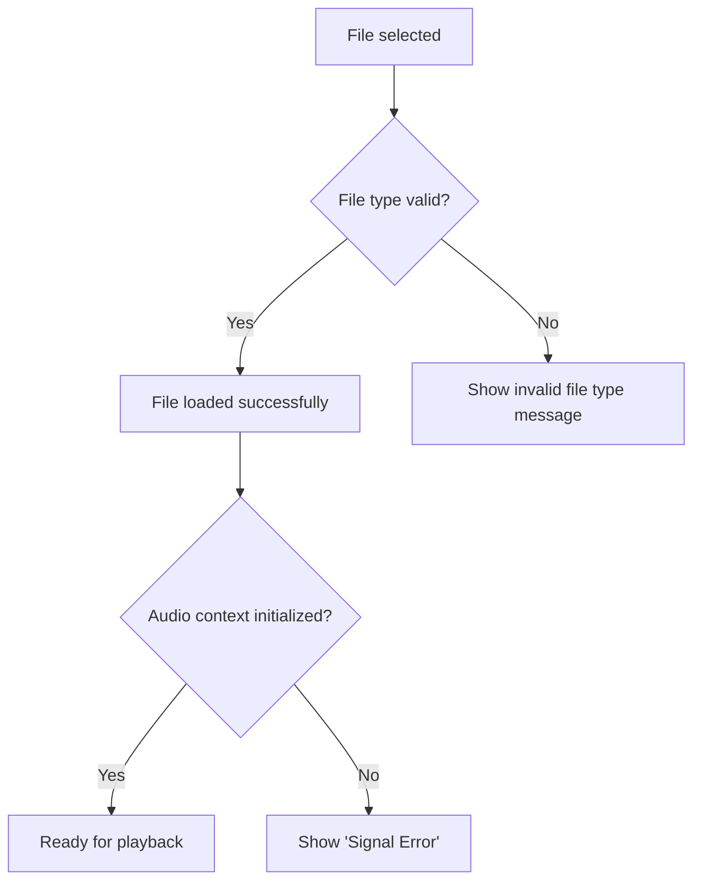

### Mic Access Errors

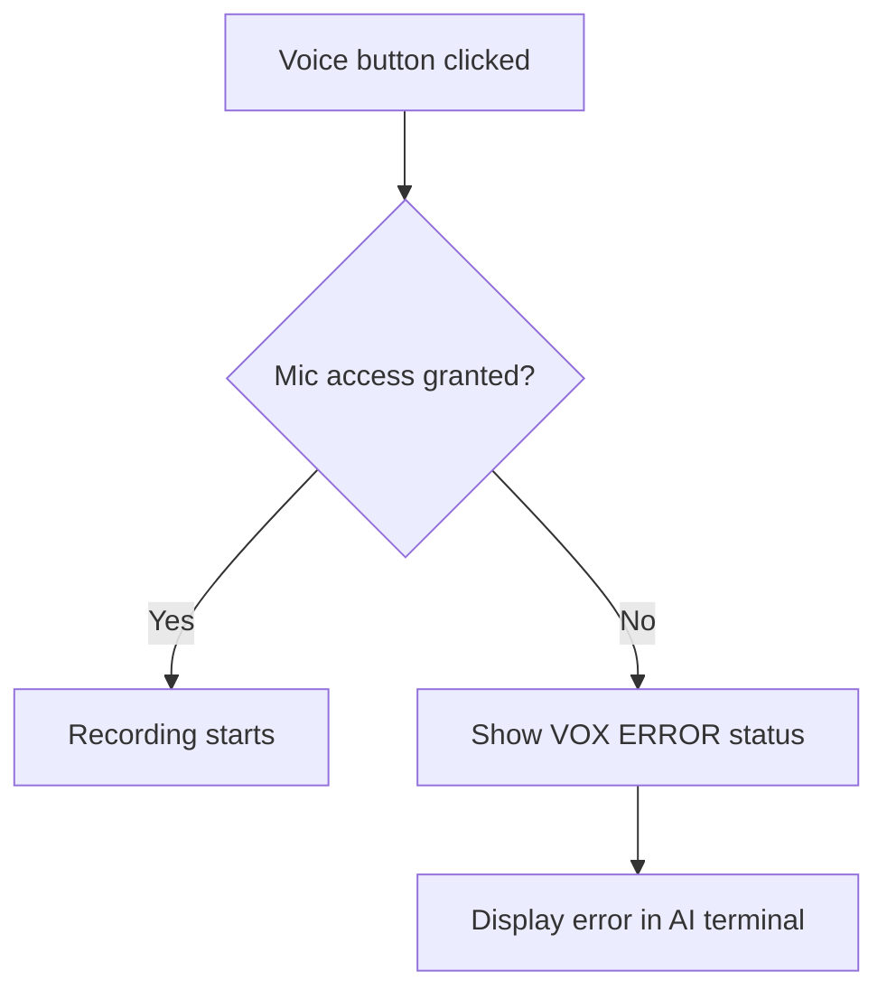

### Audio Context Errors

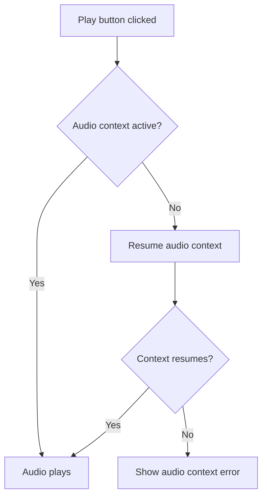

## Responsive Behavior Flows

### Screen Size Adaptation

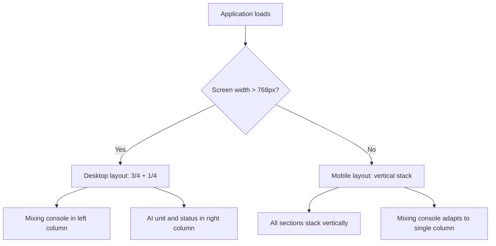

## Accessibility Flows

### Keyboard Navigation

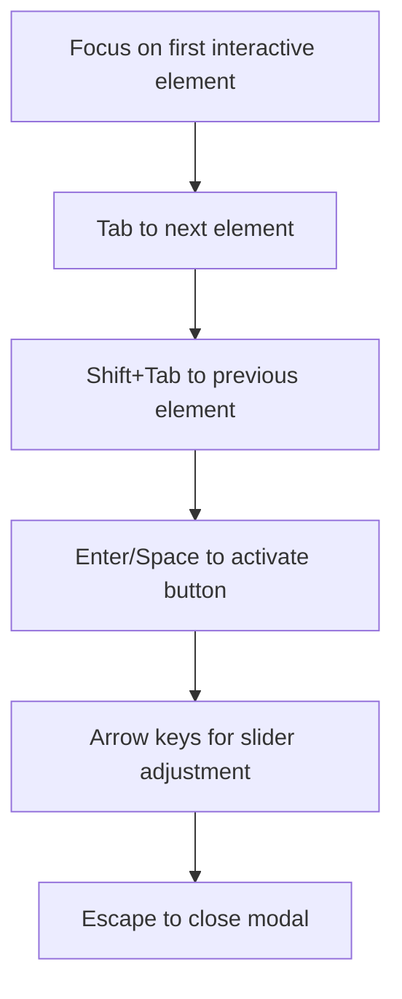

## Performance Optimizations

### Canvas Visualization

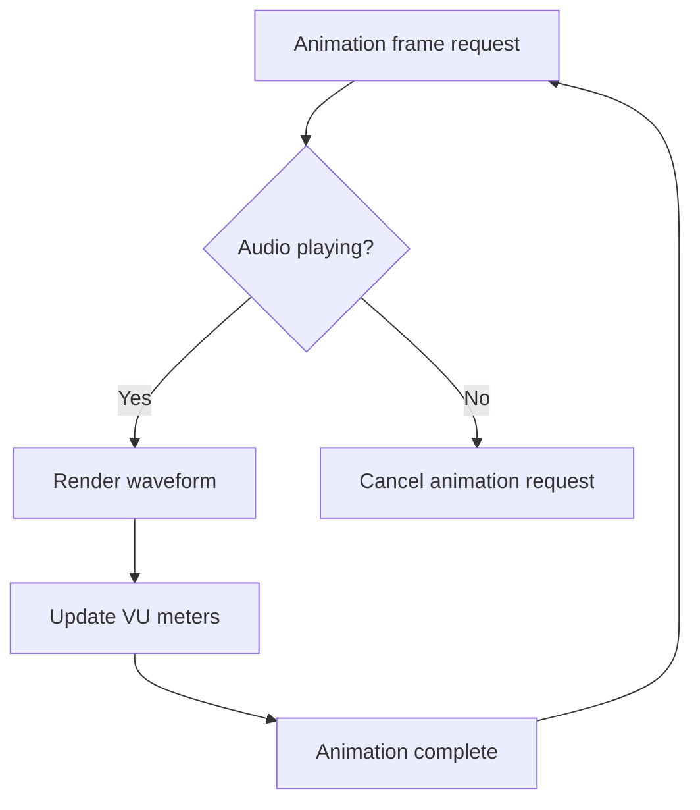

## Version History

- **1.0.0** - Initial release
  - Basic user flows for audio management
  - Stem separation and mixing workflows
  - AI assistant interaction flows
  - Error handling and accessibility flows